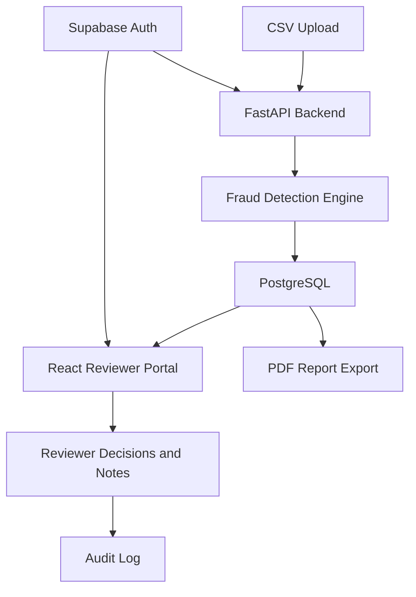

# NGO Beneficiary Integrity & Fraud Detection System

A data-quality and fraud-risk review system for NGOs that need to detect duplicate beneficiary records, suspicious repeated registrations, shared phone numbers, repeated emails, and other integrity issues before distributing support.

This repository contains two versions:

- `prototype-streamlit/`: fast local prototype for demos and experimentation.
- `production-v1/`: production-oriented React, FastAPI, PostgreSQL, and Supabase scaffold.

No real beneficiary data or API keys are included in this repository.

## Problem

NGOs often collect beneficiary data from surveys, field forms, welfare applications, and support programs. The same person may appear more than once because of accidental duplicate entry, spelling variations, repeated phone numbers, shared household details, or intentional repeated registration.

Without a review system, teams can waste limited aid, approve duplicate applications, miss suspicious patterns, and struggle to explain why a record was approved or rejected.

## Solution

The system scores beneficiary records using duplicate-detection and fraud-risk rules, explains why each record was flagged, and supports a reviewer workflow for human verification.

The prototype helps teams test the detection logic quickly. The production version adds authentication, database storage, reviewer decisions, notes, audit logs, upload history, configurable fraud weights, privacy masking, and PDF reporting.

## Features

- CSV upload for beneficiary, survey, or welfare-support data.
- Exact duplicate detection.
- Similar-name detection with fuzzy matching.
- Repeated phone and email detection.
- Same address linked to many names.
- Fraud score from `0` to `100`.
- Low, Medium, and High risk labels.
- Explanation engine for each flagged record.
- Search and filters for review.
- Downloadable clean and flagged reports.
- Reviewer workflow in production:
  - `Pending Review`
  - `Approved`
  - `Rejected`
  - `Needs Investigation`
  - `Resolved`
- Reviewer notes and decision tracking.
- Batch upload history.
- Audit log for accountability.
- Configurable fraud weights.
- PDF report export.
- Role-based access with `Admin`, `Reviewer`, and `Viewer`.
- Privacy masking for sensitive fields.

## Tech Stack

Prototype:

- Python
- Pandas
- Streamlit
- RapidFuzz
- Plotly

Production V1:

- Frontend: React, Vite
- Backend: FastAPI
- Database: PostgreSQL
- Auth: Supabase Auth
- Reports: ReportLab PDF export
- Deployment targets: Render, Railway, AWS


## How To Run

### Prototype

```bash
cd prototype-streamlit
pip install -r requirements.txt
streamlit run app.py
```

Open:

```text
http://localhost:8501
```

### Production V1

Start PostgreSQL:

```bash
cd production-v1
docker compose up -d postgres
```

Configure backend environment:

```bash
cd backend
cp ../.env.example .env
```

For local development without Supabase, add this to your local `.env` only:

```text
AUTH_MODE=dev
```

Run backend:

```bash
pip install -r requirements.txt
uvicorn app.main:app --reload --port 8000
```

Run frontend:

```bash
cd ../frontend
cp .env.example .env
npm install
npm run dev
```

Open:

```text
http://localhost:5173
```

## Architecture Diagram



## Repository Structure

```text
ngo-fraud-detection-system/
|
|-- production-v1/
|   |-- backend/
|   |-- frontend/
|   |-- README.md
|   `-- .env.example
|
|-- prototype-streamlit/
|   |-- app.py
|   |-- README.md
|   |-- requirements.txt
|   `-- sample_data.csv
|
|-- README.md
`-- .gitignore
```

## Data Safety

- No real beneficiary data is committed.
- No API keys are committed.
- `.env` files are ignored.
- `.env.example` files are safe templates only.
- Raw beneficiary data should not be uploaded to public deployments.
- Fraud scores are decision-support signals, not automatic proof of fraud.

## Environment Template

The production environment template keeps only blank placeholders:

```text
DATABASE_URL=
SUPABASE_URL=
SUPABASE_KEY=
JWT_SECRET=
```
